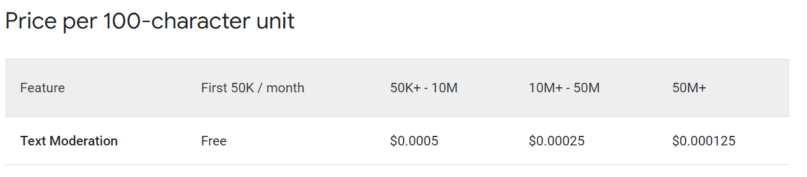

# Orange Chat Spike
=======================

## Overview

The Orange Spike project is a web scraping and natural language processing application that utilizes various APIs to search, scrape, and moderate web content. The project aims to provide a robust and efficient way to extract relevant information from the web while adhering to guidelines and avoiding profanity, harmful, or explicit content.

## Features

*   **Google Custom Search API Integration**: The project uses the Google Custom Search API to search for relevant web pages based on a given query string.
*   **Web Scraping**: The project utilizes Cheerio and Axios to scrape the content of web pages, extracting relevant information such as title, snippet, display link, and formatted URL.
*   **Natural Language Processing**: The project employs the Google Cloud Natural Language API to moderate the scraped content, ensuring it meets guidelines and avoids profanity, harmful, or explicit content.
*   **Anthropic Model Invocation**: The project uses the Anthropic model to invoke a prompt and return the indices of relevant snippets.
*   **Robots.txt Checking**: The project checks the robots.txt file for each URL to ensure scraping is allowed.

## APIs and Dependencies

*   **Google Custom Search API**: Used for searching web pages.
*   **Google Cloud Natural Language API**: Used for moderating scraped content.
*   **Anthropic Model**: Used for invoking a prompt and returning relevant snippet indices.
*   **Cheerio**: Used for web scraping.
*   **Axios**: Used for making HTTP requests.
*   **Robots-parser**: Used for parsing robots.txt files.

## Project Structure

The project is organized into the following directories and files:

*   `main.js`: The main entry point of the project, responsible for searching, scraping, and moderating web content.
*   `scrapePage.js`: Contains functions for scraping web pages and checking robots.txt files.
*   `queryModerationAPI.js`: Contains functions for moderating scraped content using the Google Cloud Natural Language API.
*   `queryBedrock.js`: Contains functions for invoking the Anthropic model and returning relevant snippet indices.
*   `searchGoogleAPI.js`: Contains functions for searching web pages using the Google Custom Search API.
*   `utils.js`: Contains utility functions for waiting for Cheerio selectors and making HTTP requests.
*   `package.json`: Contains project dependencies and scripts.
*   `readme.md`: This file, containing project information and documentation.

## Usage

To use the project, follow these steps:

1.  Install dependencies by running `npm install` in the project directory.
2.  Set environment variables for the Google Custom Search API key and CX ID in a `.env` file.
3.  Run the project by executing `node main.js` in the project directory.
4.  Provide a query string as an argument to the `main.js` script

## Costs
Google Cloud Natural Language API: https://cloud.google.com/natural-language/pricing

- Price per 100-character unit: The cost is based on units of 100 characters.